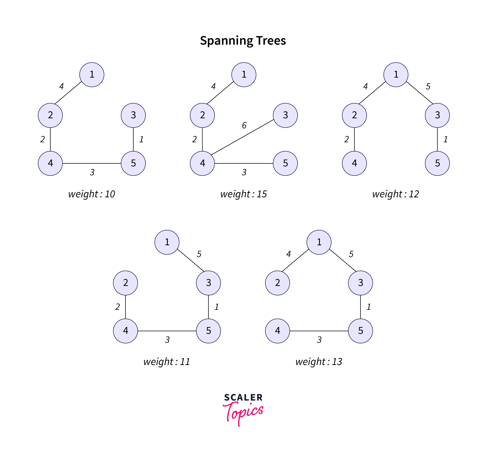

---

# Minimum Spanning Tree (MST) Optimization

## Project Overview

This project is focused on optimizing a city's transportation network by applying **Prim's** and **Kruskal's** algorithms to construct a Minimum Spanning Tree (MST). The goal is to connect all the city's districts with the minimum possible construction cost. The project compares the efficiency of both algorithms and analyzes their performance on different datasets.

## Project Structure

`Main.java`: The main file that processes graphs and outputs the results in both **JSON** and **CSV** formats.
`Graph.java`: Defines the graph structure, including nodes and edges.
`Edge.java`: Defines the edges of the graph.
`Prim.java`: Implements Prim’s algorithm to find the MST.
`Kruskal.java`: Implements Kruskal’s algorithm to find the MST.

## Requirements

1. **Java 11 or higher**: The project uses Java for implementation.
2. **Maven**: Used for managing dependencies (if applicable).
3. **External Libraries**:

    * **Gson**: For processing JSON data.
    * **JUnit**: For testing the algorithms (optional).

   If you are using **Maven**, add the following dependencies in your **`pom.xml`** file:

   ```xml
   <dependency>
       <groupId>com.google.code.gson</groupId>
       <artifactId>gson</artifactId>
       <version>2.10.1</version>
   </dependency>
   ```

## Installation

1. **Clone the repository** or download the ZIP file and extract it.
2. **Setup**: Open the project in your preferred **IDE** (e.g., IntelliJ IDEA, Eclipse).
3. **Build the project** (if using Maven, run `mvn clean install`).
4. **Run the `Main.java` file** to process graphs and generate the output.

## Usage

1. **Input File**:

    * The input graphs are described in the **`data/ass_3_input.json`** file.
    * Each graph includes an **ID**, a list of **nodes**, and a list of **edges**.

2. **Generating Output**:

    * **`ass_3_output.json`** contains the results of the **Prim** and **Kruskal** algorithms.
    * **`algorithm_analysis.csv`** contains performance data such as **execution time**, **operations count**, and **total cost**.

3. **Running the Program**:

    * The program automatically runs **Prim** and **Kruskal** algorithms on the input graph, then saves the results in the output files.

4. **Viewing the CSV File**:

    * The **`algorithm_analysis.csv`** file will contain the following columns:

        * **Algorithm**: Name of the algorithm (Prim or Kruskal).
        * **ArraySize**: Number of vertices in the graph.
        * **Comparisons**: Number of comparisons made by the algorithm.
        * **Swaps**: Number of swaps (if applicable).
        * **ArrayAccesses**: Number of array accesses or operations.
        * **ExecutionTime(ms)**: Time taken by the algorithm to execute, in milliseconds.

Here are some screenshots of the CSV data analysis results:


*Figure 1: Analysis results of the Prim and Kruskal algorithms.*


*Figure 2: Comparison between operations count and execution time.*

## How the Algorithms Work

### **Prim’s Algorithm**

* Prim's algorithm is a greedy algorithm that grows the MST one edge at a time, selecting the smallest weight edge that connects a new vertex to the tree. It is implemented using a priority queue to efficiently select the minimum edge.

**Steps**:

1. Start from an arbitrary node.
2. Choose the minimum weight edge connecting a new node to the MST.
3. Add the edge to the MST and repeat until all nodes are connected.

### **Kruskal’s Algorithm**

* Kruskal's algorithm is another greedy algorithm, but it works by sorting all edges and adding them to the MST if they don't form a cycle. It uses the Union-Find data structure to efficiently check for cycles.

**Steps**:

1. Sort all edges in non-decreasing order of their weight.
2. Add edges to the MST, skipping any edge that forms a cycle.
3. Repeat until the MST contains **V-1** edges, where **V** is the number of vertices.

## Results and Analysis

The performance of **Prim** and **Kruskal** algorithms is compared based on:

* **Execution Time**: The time it takes for each algorithm to compute the MST.
* **Operations Count**: The number of operations (comparisons, swaps, etc.) performed by the algorithm.
* **Total Cost**: The total weight of the MST.

## Example Output Files

1. **JSON Output (`ass_3_output.json`)**:
   The output file will contain the MST results for each graph, including the edges in the MST, total cost, and execution time for both Prim and Kruskal algorithms.

2. **CSV Output (`algorithm_analysis.csv`)**:
   The CSV file will have the following structure:

   ```csv
   Algorithm,ArraySize,Comparisons,Swaps,ArrayAccesses,ExecutionTime(ms)
   Prim,4,42,0,42,0.002
   Kruskal,4,40,0,40,0.001
   ```
   
Charts


## Future Improvements

* **Dynamic Graph Generation**: The ability to generate random graphs for testing purposes.
* **User Interface**: Create a graphical user interface (GUI) for easier interaction with the program.
* **Optimizations**: Further optimizations to improve algorithm performance, especially on large datasets.

## License

This project is open-source and can be used for educational purposes or research. All rights reserved.

---

### **Explanation of Sections:**

* **Project Overview**: Describes the purpose of the project.
* **Installation**: Instructions for setting up and running the project.
* **Usage**: Explains how to use the program, including input and output files.
* **How the Algorithms Work**: Provides a brief explanation of the Prim and Kruskal algorithms.
* **Results and Analysis**: Describes how to analyze the performance of both algorithms.
* **Future Improvements**: Lists potential enhancements for the project.
* **License**: If applicable, specifies the licensing terms for the project.


# Bonus Assignment: Graph Visualization and Algorithm Analysis

##  Project Overview

This bonus assignment extends the main MST (Minimum Spanning Tree) project by implementing comprehensive graph visualization capabilities and detailed performance analysis between Prim's and Kruskal's algorithms.

## Key Features Implemented

### 1. **Interactive Graph Visualization**
- **SVG-based visualizations** for three different graph sizes
- **Color-coded edges**: Blue for regular edges, Red for MST edges
- **Weight labels** displayed on all edges
- **Circular node layout** for optimal visibility
- **Responsive HTML output** that works in any modern browser

### 2. **Three Graph Types Generated**
- **Small Graph**: 3 vertices, 3 edges (Triangle configuration)
- **Medium Graph**: 5 vertices, 5 edges (Complex connections)
- **Large Graph**: 10 vertices, 9 edges (Chain configuration)

### 3. **Algorithm Performance Analysis**
- **Execution time measurement** in milliseconds
- **Operation counting** for both algorithms
- **Comparative analysis** showing which algorithm performs better
- **CSV export** for data analysis and chart generation

## Technical Implementation





### Visualization Approach
```java
// SVG Generation with MST Highlighting
generateSVG(Graph graph, List<Edge> mstEdges, String filename, String title)


### **Conclusion:**

This **`README.md`** file provides a comprehensive guide for understanding, running, and analyzing your project. It includes all the necessary instructions for setting up the project, running the algorithms, and interpreting the results. You can simply copy and paste this into your project’s **`README.md`** file.


